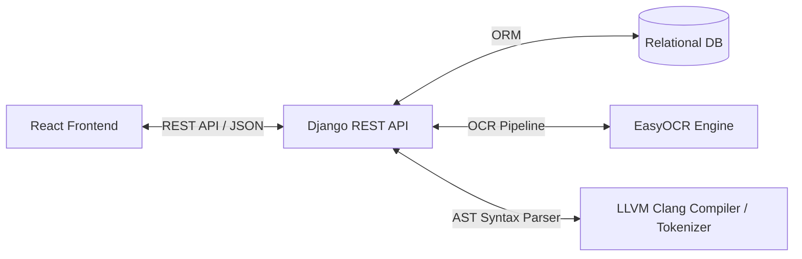

# GradeMate - System Architecture & Pipeline Documentation

This document describes the high-level architecture, design patterns, data flows, and component interactions of the GradeMate platform.

---

## 🏗 High-Level System Overview

GradeMate follows a decoupled client-server architecture consisting of:
1. **Frontend (Presentation Layer)**: React 18 single-page application built with Vite and Tailwind CSS.
2. **Backend (Application Layer)**: Django REST backend providing authentication, document processing, AST parsing, and grading logic.
3. **Database (Data Layer)**: Relational SQLite / PostgreSQL database storing users, quizzes, solutions, student submissions, and plagiarism analysis results.

---

## ⚙️ Core Processing Pipeline

When an instructor uploads a reference solution image alongside multiple student submission images, the grading engine executes the following sequential steps:

### 1. Image Preprocessing & Optical Character Recognition (OCR)
- Image files are converted to OpenCV BGR arrays.
- Applied preprocessing: Grayscale conversion, Gaussian noise reduction (`5x5`), and Otsu automated thresholding.
- EasyOCR extracts text blocks with bounding boxes.
- Bounding box Y-coordinates are sorted to reconstruct natural line ordering.

### 2. C++ Syntax Correction
- OCR output undergoes rule-based replacement for common C++ OCR errors (e.g. `includde` -> `include`, `mainC)` -> `main()`, `stc ef_` -> `std::`).

### 3. AST (Abstract Syntax Tree) Logic Parsing
- Solution text and student code text are parsed using LLVM Clang C++ parser API (`clang.cindex`).
- Generates structural AST node strings (`FunctionDecl`, `CompoundStmt`, `DeclStmt`, `BinaryOperator`, `CallExpr`).
- If LLVM Clang library binaries are missing on the host OS, the engine automatically switches to a fallback C++ structural tokenizer.

### 4. Dual Metric Evaluation
- **Levenshtein Distance**: Measures textual string similarity between student code and solution lines.
- **AST Similarity**: Measures structural syntax logic similarity between student AST tree and reference AST tree.

### 5. Weighted Final Score Computation
- Final score is computed using instructor-configured weights (`logic_weight` vs `similarity_threshold`):
$$\text{Final Score} = \frac{(\text{Levenshtein Score} \times W_{\text{sim}}) + (\text{AST Score} \times W_{\text{logic}})}{W_{\text{sim}} + W_{\text{logic}}}$$
- Grade letter is assigned:
  - **A**: Score >= 80
  - **B**: Score >= 70
  - **C**: Score >= 60
  - **D**: Score >= 50
  - **F**: Score < 50

### 6. Plagiarism Cross-Comparison
- All submission texts within a quiz are pairwise cross-compared using `RapidFuzz` token sort ratio algorithm.
- Submissions exceeding `similarity_threshold` are flagged for instructor review.
