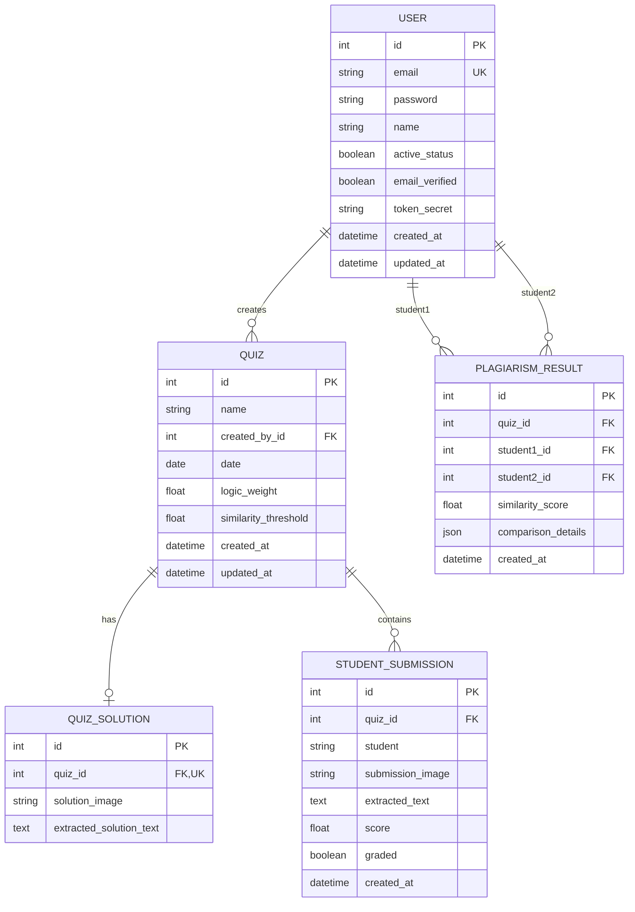

# Database Module Documentation & Schema

GradeMate uses a relational database schema (SQLite for local dev, PostgreSQL for production).

---

## 📐 Entity Relationship Diagram (ERD)

---

## 🗄 Model Specifications

### 1. `accounts_user`
- Stores user credentials, hashed passwords (bcrypt), and account state.

### 2. `quize_quiz`
- Stores quiz metadata, instructor ownership (`created_by`), logic weight, and similarity threshold.

### 3. `quize_quizsolution`
- Stores the reference solution image and its OCR-extracted C++ code.

### 4. `quize_studentsubmission`
- Stores individual student submission images, OCR-extracted code, calculated scores, and grading state.

### 5. `quize_plagiarismresult`
- Stores pairwise plagiarism comparisons and detailed match matrices between student submissions.
