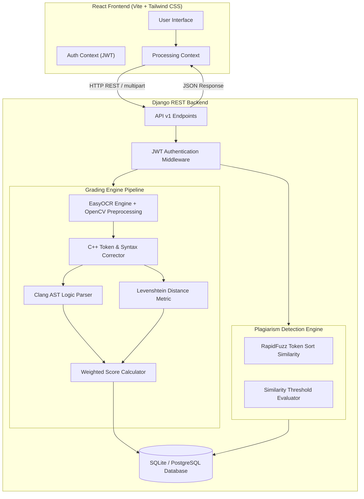

# GradeMate 🎓

> **Automated C++ Assignment Grading & Plagiarism Detection System using AI OCR, AST Syntax Trees, and String Metrics.**

[](LICENSE)
[](https://www.python.org/)
[](https://www.djangoproject.com/)
[](https://reactjs.org/)
[](https://www.docker.com/)

---

## 📌 Project Overview

**GradeMate** is an end-to-end intelligent grading platform designed to automate the evaluation of handwritten or printed programming assignments (specifically C++). By integrating **EasyOCR** text extraction, **LLVM Clang AST (Abstract Syntax Tree)** logic analysis, and **Levenshtein distance** metrics, GradeMate accurately grades student code submissions against an instructor reference solution while flagging potential plagiarism across student submissions.

---

## ✨ Key Features

- 📄 **OCR Code Extraction**: Automated line-by-line optical character recognition for handwritten and printed C++ code snippets with syntax correction.
- 🌳 **C++ AST Logic Evaluation**: Structural AST parsing via LLVM Clang to evaluate algorithmic logic independently of variable naming.
- 📊 **Weighted Grading Engine**: Configurable weighting between syntax similarity (Levenshtein) and logical structure (AST AST matching).
- 🔍 **Cross-Submission Plagiarism Detection**: Token-sort ratio and fuzzy matching cross-comparison across all student submissions in a quiz.
- 🛡️ **JWT Security & Authentication**: Secure user management with bcrypt password hashing (>= 12 rounds) and JWT Bearer token authentication.
- 🐳 **Docker & Docker Compose**: Instant containerized deployment for both backend API and frontend SPA.

---

## 🏗 System Architecture & Processing Graph



---

## 🚀 Quick Start & Installation

### Prerequisites

- **Python**: `3.11` or higher
- **Node.js**: `18.x` or higher
- **Docker & Docker Compose** (Optional for containerized run)
- **LLVM / Clang** (Optional; fallback structural tokenizer included if missing)

---

### Method 1: Docker Compose (Recommended)

Run the entire application (Backend + Frontend) with a single command:

```bash
# 1. Clone the repository
git clone https://github.com/your-username/GradeMate.git
cd GradeMate

# 2. Start services with Docker Compose
docker-compose up --build
```

- **Frontend URL**: [http://localhost:5173](http://localhost:5173)
- **Backend API URL**: [http://localhost:8000/api/v1/](http://localhost:8000/api/v1/)

---

### Method 2: Manual Local Setup

#### Step 1: Backend Setup (Django)

```bash
# Navigate to backend directory
cd gradeMate-backend

# Create virtual environment
python -m venv venv

# Activate virtual environment
# On Windows:
venv\Scripts\activate
# On Linux/macOS:
source venv/bin/activate

# Install dependencies
pip install -r requirements.txt

# Create environment file from template
cp .env.example .env

# Run database migrations
python manage.py migrate

# Start Django development server
python manage.py runserver 0.0.0.0:8000
```

#### Step 2: Frontend Setup (React)

```bash
# Open a new terminal and navigate to frontend directory
cd Grademate-main

# Install npm packages
npm install

# Create frontend environment file
cp .env.example .env

# Start Vite dev server
npm run dev
```

Visit `http://localhost:5173` in your browser.

---

## 📚 Module Documentation

Detailed module documentation is located in the [`Docs/`](./Docs) directory:

- 🏛 [Architecture Overview](./Docs/architecture.md)
- ⚙️ [Backend Engine & REST API](./Docs/backend_module.md)
- 💻 [Frontend Architecture](./Docs/frontend_module.md)
- 🗄 [Database Schema & ERD](./Docs/database_module.md)
- 🚀 [Deployment Guide](./Docs/deployment.md)

---

## 🔐 API Reference Summary

| Endpoint | Method | Auth | Description |
| :--- | :--- | :--- | :--- |
| `/api/v1/auth/signup/` | `POST` | None | Register a new user account |
| `/api/v1/auth/login/` | `POST` | None | Authenticate and receive JWT token |
| `/api/v1/auth/search_email/` | `POST` | None | Trigger password reset email |
| `/api/v1/auth/set_new_password/` | `POST` | None | Update password using reset token |
| `/api/v1/quizzes/upload_quiz/` | `POST` | JWT | Upload quiz solution & student submissions for AI grading |
| `/api/v1/quizzes/dashboard-stats/` | `POST` | JWT | Fetch instructor dashboard statistics |
| `/api/v1/quizzes/get_all_quizes/` | `POST` | JWT | List all quizzes created by instructor |
| `/api/v1/quizzes/quiz_view/` | `POST` | JWT | Fetch detailed performance results for a specific quiz |
| `/api/v1/quizzes/check_plagiarism/` | `POST` | JWT | Run cross-submission similarity analysis |

---

## 📄 License

This project is licensed under the MIT License - see the [LICENSE](LICENSE) file for details.
